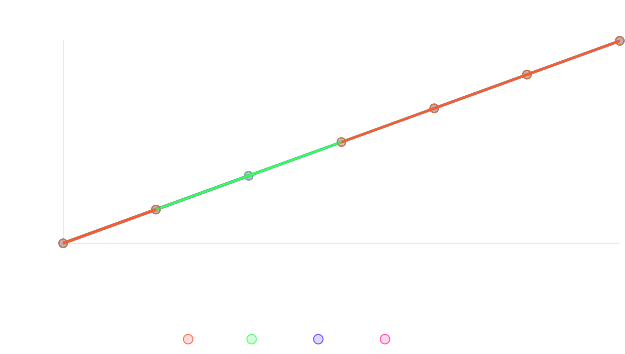

# Hệ thống truyền tệp an toàn

Dự án này triển khai một hệ thống truyền tệp an toàn theo yêu cầu của Đề tài 13, sử dụng mã hóa DES, RSA để trao đổi khóa và ký, và SHA-512 để kiểm tra tính toàn vẹn. Hệ thống sử dụng hai máy chủ trung gian để chuyển tiếp thông điệp giữa người gửi và người nhận.

## Yêu cầu
- Python 3.8+
- Visual Studio Code
- Gói Python yêu cầu: `pycryptodome`

## Thiết lập
1. **Cài đặt Python**: Đảm bảo Python 3.8 hoặc cao hơn đã được cài đặt.
2. **Cài đặt các gói phụ thuộc**:
   ```bash
   pip install -r requirements.txt
   ```
3. **Cài đặt môi trường ảo**
```bash
   python -m venv .venv
   .venv\Scripts\activate
```

4. **Chuẩn bị tệp**:
   - Đảm bảo tệp `tai_lieu_phap_ly.txt` tồn tại trong thư mục dự án (một mẫu đã được cung cấp).
   - Người nhận sẽ lưu tệp giải mã dưới tên `tai_lieu_phap_ly_nhan_duoc.txt`.
   - Nhật ký máy chủ sẽ được lưu dưới dạng 
   `nhat_ky_server1.txt` và `nhat_ky_server2.txt`.
   `nhat_ky_server1.txt, nhat_ky_server2.txt: Nhật ký hoạt động của từng máy chủ trung gian`.
   `nhat_ky_receiver.txt: Nhật ký hoạt động của người nhận`.
   `nhat_ky_receiver.txt: Nhật ký hoạt động của người nhận`.

## Chạy hệ thống
1. **Mở Visual Studio Code**:
   - Mở thư mục dự án chứa tất cả các tệp đã cung cấp.
2. **Khởi động các máy chủ và người nhận**:
   - Mở bốn cửa sổ terminal trong VS Code.
   - Chạy các lệnh sau trong các terminal riêng biệt:
     ```bash
     python receiver.py
     python server2.py
     python server1.py
     python sender.py
     ```
3. **Thứ tự thực thi**:
   - Chạy `receiver.py` trước (cổng 8003).
   - Chạy `server2.py` tiếp theo (cổng 8002).
   - Chạy `server1.py` (cổng 8001).
   - Cuối cùng, chạy `sender.py` để bắt đầu truyền tệp.
4. **Kết quả**:
   - Kiểm tra `tai_lieu_phap_ly_nhan_duoc.txt` để xem tệp đã giải mã.
   - Kiểm tra `nhat_ky_server1.txt` và `nhat_ky_server2.txt` để xem nhật ký giao dịch.
   - Người gửi và người nhận sẽ in các thông điệp trạng thái (ví dụ: ACK/NACK).

## Lưu ý
- Triển khai này đơn giản hóa việc kiểm tra chữ ký RSA do khó khăn trong việc chia sẻ khóa công khai của người gửi một cách động. Trong hệ thống thực tế, hãy sử dụng cơ quan chứng nhận hoặc khóa được chia sẻ trước.
- Hệ thống giả định tất cả các thành phần chạy trên `localhost`. Cập nhật các biến host/port cho các thiết lập phân tán.
- Hệ thống sử dụng socket TCP để đảm bảo truyền thông tin cậy.
- Nhật ký bao gồm thời gian theo định dạng UTC.

## Xử lý sự cố
- **Lỗi kết nối**: Đảm bảo tất cả các máy chủ đang chạy trước khi khởi động người gửi.
- **Không tìm thấy mô-đun**: Xác minh rằng `pycryptodome` đã được cài đặt.
- **Xung đột cổng**: Thay đổi số cổng trong các tập lệnh nếu cổng 8001–8003 đang được sử dụng.
- **Nhận được NACK từ receiver**:Kiểm tra lại khóa công khai, khóa phiên, hoặc chữ ký số.
Đảm bảo file truyền không bị thay đổi hoặc lỗi trong quá trình mã hóa/giải mã.
Xem chi tiết lý do NACK trong nhat_ky_receiver.txt hoặc thông báo trên terminal.
- **Lỗi giải mã (ValueError, JSONDecodeError, UnicodeDecodeError, v.v.)**:Đảm bảo các thành phần sử dụng đúng phiên bản Python và các gói phụ thuộc.
Kiểm tra lại quá trình truyền dữ liệu, tránh mất gói hoặc truyền thiếu.
- **Lỗi "Bắt tay thất bại" hoặc "Lỗi khóa công khai người gửi"**:Đảm bảo các thành phần khởi động đúng thứ tự.
Kiểm tra lại logic trao đổi khóa giữa các thành phần.
- **Lỗi "Băm không khớp" hoặc "Chữ ký không hợp lệ"**:Đảm bảo file gốc không bị thay đổi trong quá trình truyền.
Kiểm tra lại quá trình tạo và kiểm tra chữ ký số.
- **Lỗi file nhật ký không ghi được**:Kiểm tra quyền ghi file trong thư mục dự án.
Đảm bảo không có tiến trình nào khác đang khóa file nhật ký.

## Luồng hoạt động
<pre>
Sender ----> Server1 ----> Server2 ----> Receiver
|          |            |            |
| Hello!   | Hello!     | Hello!     | Ready!
| Ready!   | Ready!     | Ready!     |
|          |            |            | Public Key
|<---------|------------|------------|
| Public Key            |            |
|--------->|------------|------------|
| Session Key           |            |
|--------->|------------|------------|
| Packet (cipher, hash, sig, metadata)
|--------->|------------|------------|
| ACK/NACK |            |            |
|<---------|------------|------------|
</pre>

## Cấu trúc thư mục
<pre>
BTL_THAY_CONG/
├── .venv/
├── docs/
│   ├── legal_doc.txt
│   ├── tai_lieu_phap_ly_nhan_duoc.txt
│   └── tai_lieu_phap_ly.txt
├── logs/
│   ├── nhat_ky_receiver.txt
│   ├── nhat_ky_sender.txt
│   ├── nhat_ky_server1.txt
│   └── nhat_ky_server2.txt
├── src/
│   ├── receiver.py
│   ├── sender.py
│   ├── server1.py
│   └── server2.py
├── image.png
├── README.md
└── requirements.txt
</pre>
---

## Sơ đồ hệ thống
